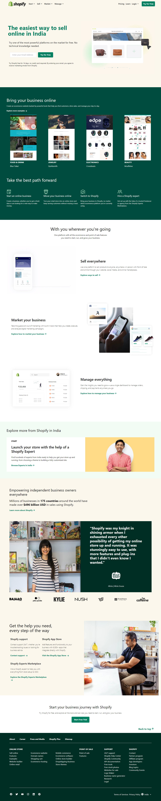

# Assignment 1

## This is Clone of [Shopify.com](https://www.shopify.com).

## Shopify Clone Live Link  [Shopify Clone Link](https://nachiketkeripale-shopify-clone.netlify.app/).

- Create this project from scratch and used Tailwind CSS.
- Tailwind CSS was a fantastic learning experience for me.
- Discovered how to construct responsive web pages using Tailwind Class.
- Explored Tailwind CSS Docs to understand more about Class. 

---

## Time taken to finish this project

-   9+ hour to complete it.

#### Screenshot

 

